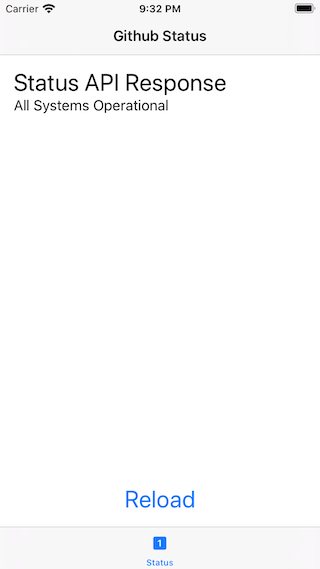

# iOSDC2020-Sample-Proxyman

 

iOSDC2020冊子内記事 `プロキシツールProxymanの紹介と開発時に役立つTips` のサンプルコードです。

## サンプルコードの内容

[Github Status API](https://www.githubstatus.com/api)のうち、[Status情報](https://www.githubstatus.com/api#status)を取得して表示します。

## 動作環境

- Xcode: 11.6
- Deployment Target: 13.0
  - SwiftUIを使っているため、iOS12.x以前に下げることはできません。
